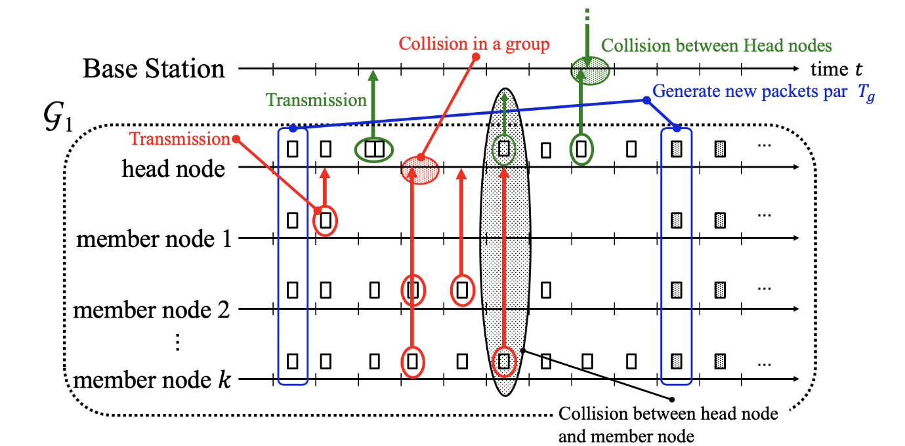

# hs_aloha
This repository is an proposal of implementation for the Hierarchical Slotted ALOHA using python language




## Simulation variables
The simulation variables can be set as environment variables.
To do this you just need uncomment the fillowing lines in the `main.py` and change the values.

```python
# os.environ["SUBNETS"] = "2"
# os.environ["NODES_PER_NET"] = "2"
# os.environ["LOOPS"] = "1000"
# os.environ["GENERATE_INTERVAL"] = "100"
```

## How to use
```bash
# install dependencies
python3 -m pip install -r requirements.txt

# run the main file
python3 main.py
```

When executed a file called `aloha.log` will be created containing the log interactions.
```bash
# non collisons
DEBUG:root:SUBNET_0:GENERATING PACKAGES
DEBUG:root:SUBNET_0:MEMBER -> HEAD_NODE
DEBUG:root:BASE_STATION:HEAD_NODE -> BASE_STATION

# collisions
DEBUG:root:SUBNET_0:MEMBER COLLISION
DEBUG:root:SUBNET_0:HEAD_MEMBER COLLISION
DEBUG:root:BASE_STATION:HEAD_NODE COLLISION
```

### References:
[T. Oku, T. Kimura and J. Cheng, "Performance Evaluation of Hierarchical Slotted ALOHA for IoT Applications," 2020 IEEE International Conference on Consumer Electronics - Taiwan (ICCE-Taiwan), 2020, pp. 1-2, doi: 10.1109/ICCE-Taiwan49838.2020.9258134.](paper.pdf)